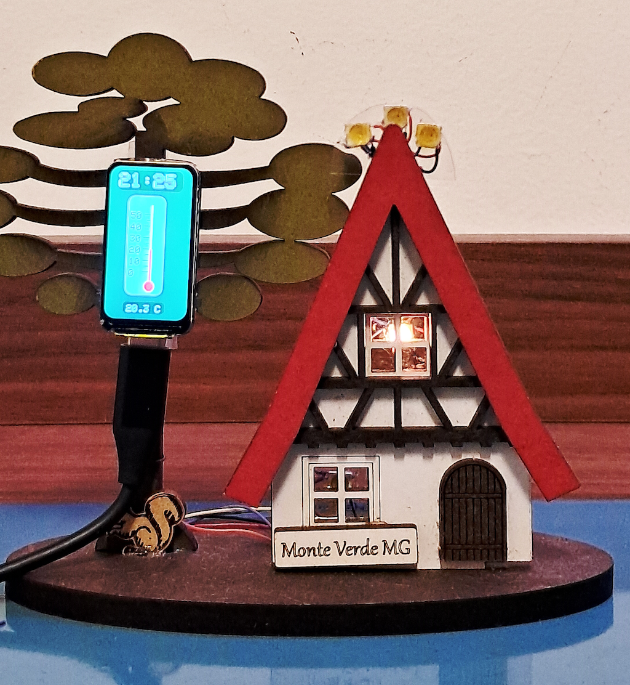

# Termômetro "Monte Verde"

A ideia deste projeto é acrescentar a um enfeite um termômetro e LEDs RGB controlados por um microcontrolador.

## Hardware

### Componentes

O componente principal é um ESP32-C6-LCD-1.47" da Waveshare. Este módulo contém um display LCD colorido com resolução de 172x320 pontes e um microcontrolador ESP32-C6.

Os recursos de comunicação sem fio do ESP32-C6 são subutilizados neste projeto. É usado apenas o WiFi para obter a data e hora atuais, usando o protocolo SNTP.

O sensor de temperatura é um HDC1080, que possui uma boa precisão e interface I2C.

Os LEDs RGB são do modelo WS2812B (popularmente conhecidos como "endereçáveis"). Em outras ocasiões usei LEDs em fitas ou em placas individuais; este caso usei o componente SMD para reduzir o custo (comprei 50 LEDs por um preço inferior a 30 com placa individual).

### Montagem

A montagem elétrica foi feito soldando fios de wire-wrap diretamente no componentes. A soldagem nos LEDs RGB foi um pouco delicada, mas sem grandes problemas.

A montagem mecânica usou fita dupla-face e cola de contato. Os LEDs foram fixados em pedaços de plástico recortados de uma embalagem.

## Software

O software foi desenvolvido na IDE Arduino.

O display é acessado usando as bibliotecas GFX e ST7789 da Adafruit. Usei umas rotinas minhas para o SNTP e leitura do sensor de temperatura.

## Operação

O funcionamento normal consiste em:

* Apresentar no display a hora e temperatura, assim como uma representação gráfica de termômetro.
* Utilizar três LEDs para indicar o Sol. O LED aceso corresponde ao período do dia (manhã, meio-dia ou tarde); a intensidade aumento do nascer do Sol até o meio dia e depois diminui até a noite.
* Dois LEDs iluminam as janelas e são acesos durante no final da tarde e no nascer do Sol.

Um modo demostração pode ser acionado pressionando o botão BOOT quando o LED interno ao módulo ESP32-C6-LCD acender na cor cor vermelha e mantendo o botão apertado até o LED apagar. Neste modo, relógio e temperatura são simulados de forma acelarada, permitindo ver o comportamento dos LEDs ao longo do dia.

## Sugestões de Aperfeiçoamento

A imagem no display poderia ser melhorada, por exemplo usando fontes melhores que o padrão.

O WiFi poderia ser usado para obter o clima atual e apresentá-lo no display (ou mudar o comportamento dos LEDs).

Poderiam ser colocados mais LEDs para melhorar a movimentação do Sol (por exemplo um arco cercando a figura toda).

A logica de acionamente dos LEDs poderia ser mais softisticada, por exemplo acrescentando uma componente aleatórea.

## Referências

1. https://waveshare.com/wiki/ESP32-C6-LCD-1.47
2. https://leanpub.com/sensorespico
3. https://www.seeedstudio.com/document/pdf/WS2812B%20Datasheet.pdf